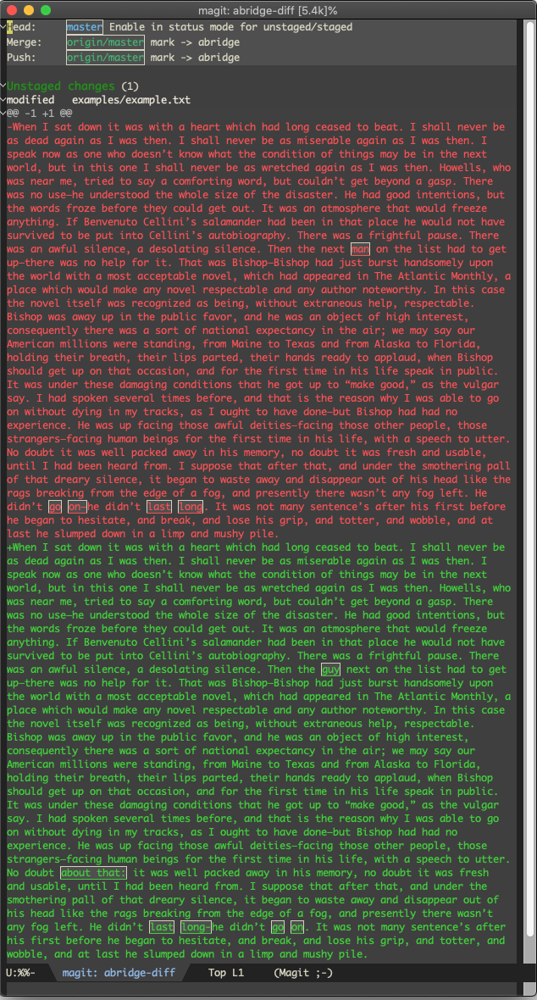
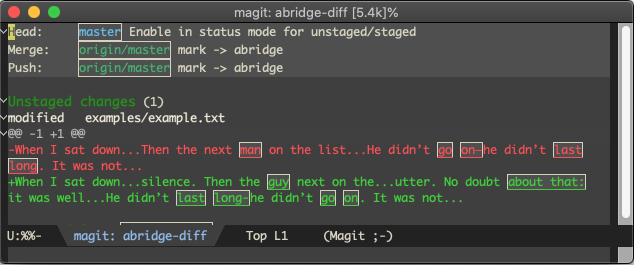

# abridge-diff
A simple Emacs package for _abridging_ refined diff hunks (for example in [magit](https://github.com/magit/magit)).  Useful for line-based diffs of files with very long lines, as in LaTeX files or text files with full paragraphs per line (often using `visual-line-mode`).

Simplest to illustrate with a pair of pictures:
### Before
For long, multi-sentence paragraphs on a single line, showing a few changes produces lots of useless context:

### After
Using `abridge-diff`, only the refined changes and a bit of surrounding context are shown.  Much cleaner:

## Usage:

Once installed, `abridge-diff` will start abridging all _refined_ diff hunks. You can enable and disable showing the abridged version using `abridge-diff-toggle-hiding`.  Automatically configures itself to work with [magit](https://github.com/magit/magit), adding a new `D a` diff setup command, which toggles the abridging. 

## Magit tips

You need to enable hunk refining for this to do anything in magit.  This works best with `magit-diff-refine-hunk` set to `'all` (so that all hunks in a given diff have their refined differences computed in one pass).  If you are working with long lines, this has the most impact with limited or no surrounding-line context (`-U0`, just hit `-` repeatedly).  Applying abridged diff hunks should work as normal.

## How this works:

This works by adding a post-processing step after `diff-refine-hunk` (which itself uses `smerge-refine-regions`).  This protects all refined differences and a configurable amount of context around them, and computes regions to hide using `'invisibility` text properties.  Note that the abridged text is still there, so toggling hiding simply reveals it.

## Settings:

You can customize settings with these variables; just `M-x customize-group abridge-diff`:

- **abridge-diff-word-buffer**:  Number of words to preserve around refined regions.
- **abridge-diff-first-words-preserve**:    Keep at least this many words visible at the beginning of an abridged line with refined diffs.
- **abridge-diff-invisible-min**: Minimum region length (in characters) between refined areas that can be made invisible.
- **abridge-diff-no-change-line-words**: Number of words to keep at the beginning of a line without any refined diffs.
